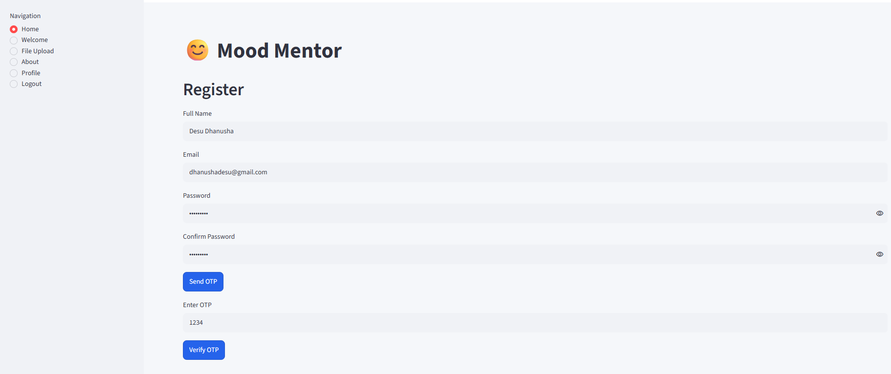
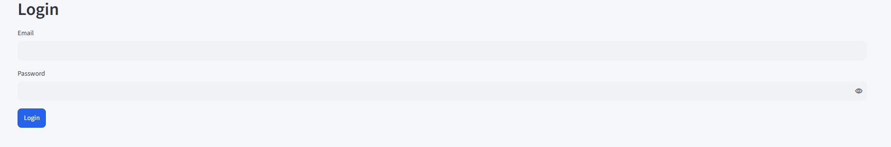
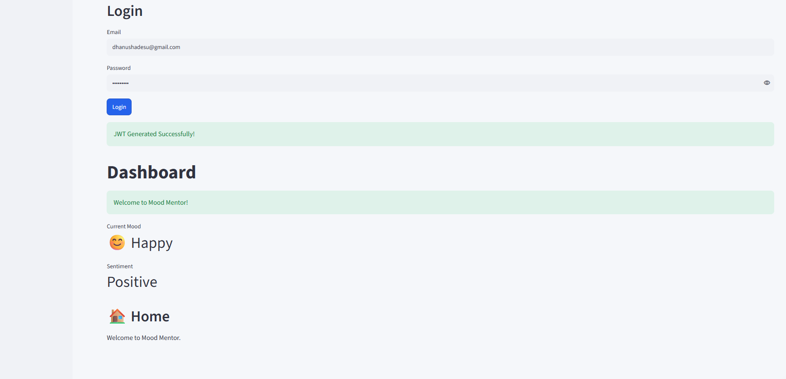

# Milestone 1

## Objective
Develop a secure Employee Wellness Management System with user authentication.

## Features
- User Registration
- Email OTP Verification
- Secure Login using JWT
- PostgreSQL (Neon DB) Integration
- Streamlit Web Interface

## Technologies Used
- Python
- Streamlit
- PostgreSQL (Neon DB)
- JWT Authentication

  ## Google Colab Setup Instructions

1. Open `Authentication.ipynb` in Google Colab.
2. Add the required Secrets:
   - DB_HOST
   - DB_PORT
   - DB_NAME
   - DB_USER
   - DB_PASSWORD
   - JWT_SECRET
   - SMTP_EMAIL
   - SMTP_APP_PASSWORD
   - NGROK_AUTHTOKEN
3. Run all notebook cells.
4. Open the generated Streamlit URL.
5. Register a new account, log in, and test the application.

## Screenshots

### Home Page

### Login Page

### Dashboard

### Users Database Table

### OTP Verification Table

