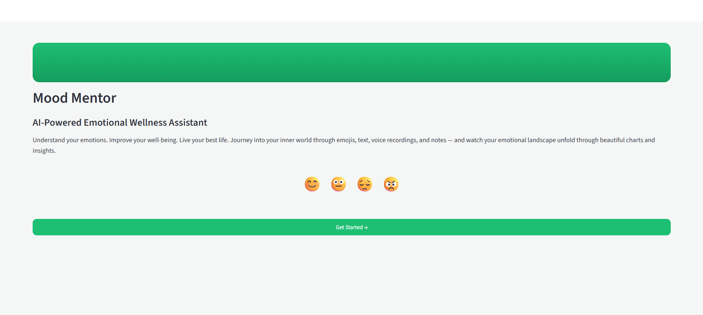
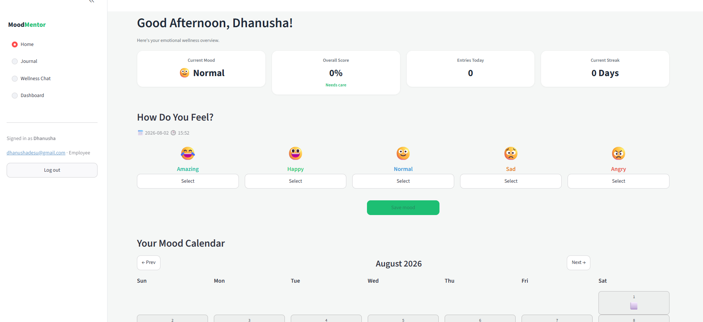
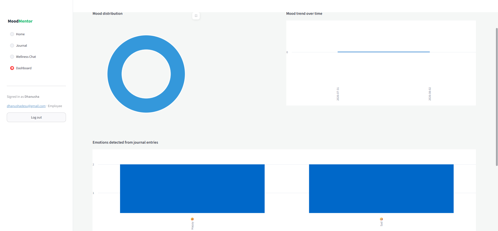
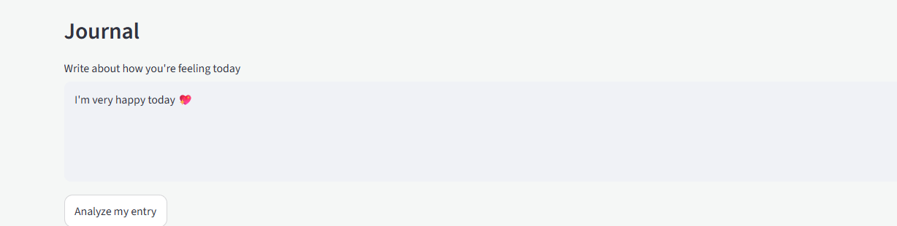
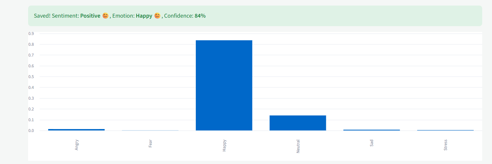
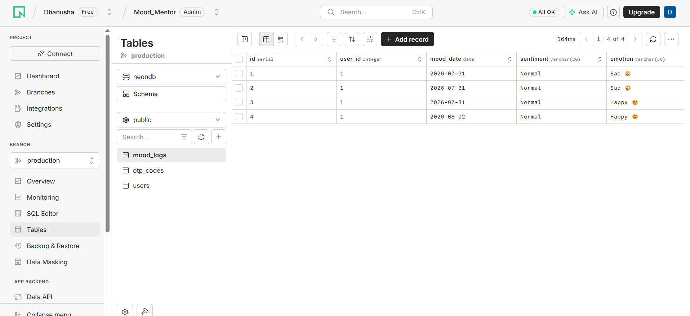

# Employee Wellness Management Analytics

## Milestone 3

### Project Objective
Develop an AI-powered Employee Wellness System that detects emotions from multilingual journal entries and provides wellness recommendations.

---

## Model Used

- Qwen Transformer Model
- BERT Embeddings
- VADER Sentiment Analyzer

---

## Emotion Detection Pipeline

Journal Input

↓

Language Detection

↓

Preprocessing

↓

Transformer Emotion Prediction

↓

Confidence Score

↓

VADER Sentiment

↓

Wellness Recommendation

↓

Store in PostgreSQL

---

## Confidence Score

The transformer predicts the dominant emotion with a confidence probability.

Example

Happy — 96.54%

---

## Sentiment Analysis

Positive

Negative

Neutral

Compound

---

## Database Schema

Users

Journal Entries

Emotion Results

Sentiment Scores

---

## API Endpoints

/signup

/login

/journal

/analyze

/dashboard

---

## Sample Input

Today I completed all my work and I feel very happy.

Output

Emotion : Happy

Confidence : 96%

Compound Score : 0.82

Recommendation :

Keep maintaining your healthy routine.

---

## Observations

The hybrid NLP pipeline successfully combines transformer-based emotion detection with VADER sentiment analysis for multilingual journal entries.

---
## Screenshots

### Login Page

### Home

### Dashboard

### Journal

### Emotion Detection

### Database

